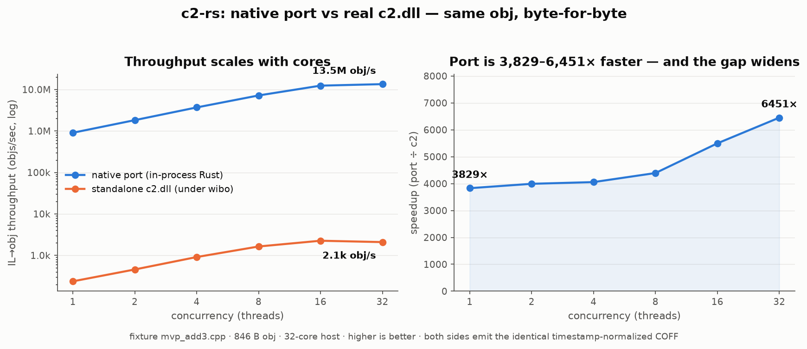

# c2-rs

A native Rust port of `c2.dll` — the code generator from the MSVC compiler
that shipped with the Xbox 360 XDK (16.00.11886.00) — plus the differential
harness that keeps the port honest by diffing it against the real thing.

## The goal (decided 2026-08-21)

Two ends, ranked equally:

1. **Perfect reproduction, to understand MSVC's internals** — the port and the
   whitebox record that comes with it are how we learn what the original
   compiler actually does, which is what makes decomp tractable.
2. **Parity: a 100% open-source implementation** of this back end.

Speed is a *property* of a native port, not the reason for it. The throughput
numbers below are real and still measured, but the section that follows was
written when throughput **was** the thesis, and it no longer is — see
`CLAUDE.md` § "The goal" and `docs/ARCH_REVIEW_2026-08-21.md` §7 for what
changed and why. Read "Why bother" as history, and as an accurate description
of the speedup, not as the project's objective.

## Why bother

I work on matching decompilation of Xbox 360 games. "Matching" means you write
C++ that the *original* compiler turns into the *original* bytes, so the
original compiler sits inside every feedback loop: every candidate function,
every permutation, every scoring pass ends in a compile. The compiler runs
fine on Linux under [wibo] (a lightweight Windows PE loader, not an emulator),
but each invocation costs a process spawn plus a few milliseconds of real
work, and it doesn't parallelize well — even the back end alone, run 32-wide,
tops out around 3k objs/sec on my machine. When a search wants to score
millions of candidates, that's the wall.

MSVC has a useful seam: `cl.exe` is a two-stage pipeline. The front end
(`c1xx.dll`) parses C++ and writes an intermediate language to disk as five
temp files; the back end (`c2.dll`) reads those files and writes the `.obj`.
Both stages can be driven standalone, so the IL bundle is a real interface —
and porting "IL bundle in, COFF obj out" is a much smaller problem than
porting a C++ compiler.

So this repo ports the back end *behaviorally*. The port is allowed to be
modern Rust with any internal structure it likes, as long as:

> for every IL bundle, `port(IL) == c2(IL)`, byte-exact
> (with the 4-byte COFF timestamp zeroed).

There is no attempt to reproduce c2.dll's own code, and no decompiled source
anywhere in the port. The original binary is treated as a black box and its
observable output as the spec, **with a disclosed list of exceptions** — every
one of them logged with its address in
[`docs/whitebox/DISCLOSURE.md`](docs/whitebox/DISCLOSURE.md). That ledger is the
complete list — the claim above is **per-finding**, not blanket, and every row
in it names the site so a reader can re-check the reading. Rows are of two
kinds: `adoption`, where a value, bit position or field layout is copied, and
`route:`, where the disassembly said *where to look* and the fact was then
established from the oracle's own output. Several rows are additionally
**instrument-only** — the stage tap's site addresses and record layouts, and
the opcode/encoding tables read by
`crates/c2-reference/tests/middle_interfaces.rs` — and touch no emit path and
no refusal predicate. The real `c2.dll` stays resident under wibo as the judge,
and the port never grades itself.

*(This paragraph used to enumerate "one adoption and two routes" by name. The
enumeration went stale as the ledger grew, which is exactly the failure mode a
count-in-prose invites; the ledger is the count.)*

Honest caveat: verification is differential testing, so a green run is only
as strong as the corpus it ran against. That's why corpus breadth gets its
own tooling here (`c2rs corpus`), and why anything the port can't prove it
handles returns `NotImplemented` instead of guessing.

## What works today

* **Standalone back-end replay is proven — on real code.** Feeding a captured
  IL bundle back through `c2.dll` alone (via the tiny `c2host` stub under
  wibo) reproduces the full-pipeline `.obj` byte-for-byte on all 25 fixtures
  *and on all 871 capturable translation units of a real Xbox 360 game
  codebase, compiled with the game's real flags*. This is the foundation
  everything else stands on: the reference side of the differential is real,
  not approximated. (`c2rs replay`, `c2rs gap --replay-every 1`)
* **The native port is byte-exact on its first function class** — straight-line
  integer arithmetic leaves, tail calls, and a single framed non-leaf call.
  Same IL in, same 5-section COFF out, verified against real c2 on every run.
  Everything outside that class returns `NotImplemented`; that boundary is
  the open frontier, not a footnote. (`c2rs diff`)

  **Scope of that claim, measured 2026-08-09** (lane `w-readpx`, board
  #2280–#2293): it holds **on the fixtures**, where it is checked every run.
  On the 878-TU workload the admitted classes are **bimodal** — ten
  one-function classes are `fnbyte-exact` 11/11, and five *call-bearing*
  classes are **0.000 over 1,106 bodies**, `framed-call` among them at
  **0-for-123**, because c2 inlines callees the port keeps as calls. No wrong
  `.obj` results (the emit path's fence is total — lane `w-inlfence`, board
  #2220–#2227), but "byte-exact on the class" must be read as *on the class as
  fenced by the fixtures*, not as a workload-wide property.
* **Standalone front-end replay is proven too.** Driving `c1xx.dll` alone
  (via the sibling `c1host` stub) reproduces the captured IL bundle
  byte-for-byte on all 25 fixtures. That opens the same porting path for the
  front end, which would eventually make source→obj fully in-process.
  (`c2rs replay-c1`)
* **The gap is measured, not guessed.** `c2rs gap` runs the whole pipeline
  over a list of real TUs with their real compile flags and buckets every one
  of them: does capture fail, does IL decode fail, does codegen refuse, do
  the bytes diverge, or does it match — with the blocking reasons ranked. The
  first baseline is honest and stark: on 878 real TUs the port currently
  reaches byte-exact on none of them, because 99% die at IL decode before
  codegen is even consulted. That number is the roadmap
  ([`docs/ROADMAP.md`](docs/ROADMAP.md)), the per-blocker ledger with
  measured frequencies and per-rung acceptance gates is
  [`docs/GAPS.md`](docs/GAPS.md), and the scan (under a minute for the whole
  codebase) reruns on every widening step so it can only be improved, not
  argued with.
* **Corpus, retrieval, and search tooling** on top: a deterministic
  `(source, IL, obj)` corpus generator, an obj→IL retrieval baseline, and an
  IL-space search prototype that edits bundles and asks the compiler to
  confirm. These are experiments riding on the harness rather than parts of
  the port itself.

The knowledge recovered along the way (COFF field classification, PPC
encodings, the IL bundle format, the observed register-allocation order) is
written up in [`docs/`](docs/README.md).

## Performance

The point of the port is speed, so here's the honest picture — both sides
compiling the same IL bundles to the same bytes, port in-process vs
standalone `c2.dll` under wibo:



Per obj the port is around 1200–5000× faster (a microsecond or two against
4–6 ms), and because it has no per-obj process and no shared state it scales
almost linearly with cores: ~922k objs/sec on one thread and ~15.3M at 32 on
my machine, against ~240–2900 for real c2, which saturates early on spawn
overhead. `c2rs perf` checks the port's output is byte-exact to real c2 on
every fixture *before* timing anything, so the speedup is never bought with
wrong bytes.

Two bounds on reading that ratio (`docs/PRIOR_ART.md` §"Amdahl", measured on
real dc3 TUs): the scaling numbers are taken on fixture-sized bundles, where
most of real c2's cost is process spawn and PE load — on a workload-sized TU
c2 does ~150 ms of genuine work and the port's speedup there is unmeasured,
because the port does not yet accept one; and in a source→obj loop the c2
stage is 10–37 % of the compile, so an infinitely fast c2 buys 1.1–1.6× there.
The full ratio is available only to IL-space loops, where c2 is the whole
cost.

Reproduce with:

```sh
cargo run -p c2-harness --bin c2rs -- perf
cargo run -p c2-harness --bin c2rs -- perf-scale --csv docs/perf/perf_scale.csv
python3 scripts/plot_perf.py   # regenerates the graph (matplotlib)
```

## Setup

Prebuilt `c2rs` binaries for Linux and Windows are on the
[releases page](https://github.com/freeqaz/c2-rs/releases) if you don't want
to build from source (building is just `cargo build --release`, though — no
dependencies). For the harness to have something to test against, you need
two more things, neither of which is committed here:

1. **wibo** — grab a release binary from
   [decompals/wibo](https://github.com/decompals/wibo) and put it on your
   `PATH` (or build it; a sibling `../wibo` checkout's build tree is also
   found automatically).
2. **The compilers** — the X360 MSVC toolchain, fetched from this repo's
   [releases](https://github.com/freeqaz/c2-rs/releases) (a verbatim mirror
   of the decomp.dev compilers archive the decomp community's build systems
   use, which stays as a fallback mirror):

   ```sh
   scripts/fetch_compilers.sh   # ~70 MB download → ./compilers/X360/16.00.11886.00/
   ```

Everything is overridable by environment variable if your layout differs:

| Env var | Default |
|---------|---------|
| `C2RS_WIBO` | `../wibo/build/release/wibo`, else `wibo` on `PATH` |
| `C2RS_COMPILERS` | `./compilers`, else `../dc3-decomp/build/compilers` |
| `C2RS_CL_EXE` / `C2RS_C2_DLL` / `C2RS_C1XX_DLL` | `<compilers>/X360/16.00.11886.00/…` |
| `C2RS_STRACE` / `C2RS_MINGW` | found on `PATH` |

The replay paths additionally use `strace` (to keep the temp IL files alive,
see below) and `i686-w64-mingw32-gcc` (to build the host stubs). If anything
is missing, tests and subcommands print `SKIP: toolchain absent` and exit
cleanly rather than failing — `cargo test --workspace` always works.

## Running

```sh
cargo test --workspace                            # unit tests always; integration tests when toolchain present

cargo run -p c2-harness --bin c2rs -- selftest    # oracle self-test: determinism + capture stability
cargo run -p c2-harness --bin c2rs -- replay    fixtures/cpp/add3.cpp      # standalone-c2 replay, byte verdict
cargo run -p c2-harness --bin c2rs -- replay-c1 fixtures/cpp/add3.cpp      # standalone-c1 replay, per-file verdict
cargo run -p c2-harness --bin c2rs -- diff      fixtures/cpp/mvp_add3.cpp  # full differential: Port=Match
cargo run -p c2-harness --bin c2rs -- diff      fixtures/cpp/add3.cpp      # Port=NotImplemented (outside the class)
```

Run `c2rs` with no arguments for the full subcommand list (`capture`,
`bench`, `perf`, `corpus`, `retrieve`, `search`, …).

## How IL capture works

This deserves a note because it's the least obvious trick in the repo.
`cl.exe` deletes the `_CL_*` IL temp files as soon as compilation finishes,
and there's no supported flag to keep them. But `/Bd /d2nop` makes c2 abort
early — *after* the front end has written the bundle, *before* the driver
cleans up — so the five files survive, and the compiler's own output echoes
the exact argv it passed to each stage. The capture path scrapes the bundle
base name from the `-il <path>` token in that output. (That compile exits
non-zero; the surviving `_CL_*ex` file is the success signal.)

For the *reference* capture — where c2 must actually run to produce the obj
*and* the bundle must survive — the harness runs the compile under `strace`
with a fault injector that turns `unlink` into a no-op. Crude, effective.

Replays then go through two tiny C stubs (`c2host/`, `c1host/`), built
on demand with mingw and run under wibo, that `LoadLibrary` the DLL and call
its `_InvokeCompilerPass` export directly with a reconstructed argv. The
front-end stub also has to reproduce two things `cl.exe` normally does:
reserve the compiler's heap arena at the address encoded in the `-zm`
argument, and provide a `1033/` resource directory next to the exe so
`c1xx.dll` can find its diagnostics DLL.

## Workspace layout

| Crate | What it is |
|-------|------------|
| `crates/c2-il` | The IL bundle model: the five files as bytes, plus the decoded `.ex` structure and edit primitives. |
| `crates/c2-obj` | COFF handling for the compare: timestamp normalization, diffing. |
| `crates/c2-core` | The port: `Backend` trait, `PortC2`, PPC instruction selection, COFF emission. |
| `crates/c2-reference` | The oracle: drives real `cl.exe`/`c1xx.dll`/`c2.dll` under wibo — compile, capture, replay. |
| `crates/c2-harness` | The `c2rs` CLI and everything that grades the port. |
| `c2host/`, `c1host/` | The standalone-DLL host stubs (C, built on demand, never committed as binaries). |
| `fixtures/cpp/` | Small include-free C++ test programs. Only the `.cpp` files are tracked; IL and objs are regenerated. |

The Rust workspace is std-only with zero external crates, deliberately —
fewer moving parts under the byte-exactness microscope.

[wibo]: https://github.com/decompals/wibo
